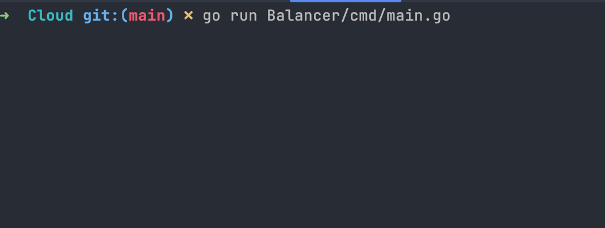
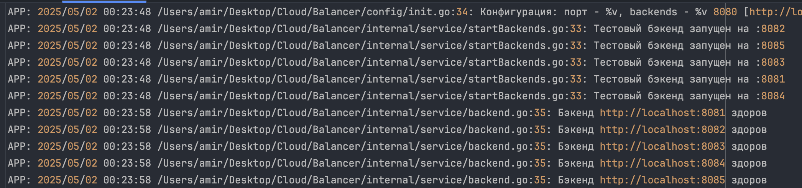
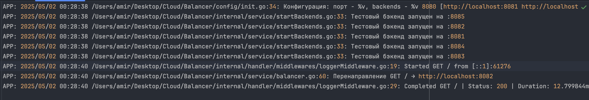
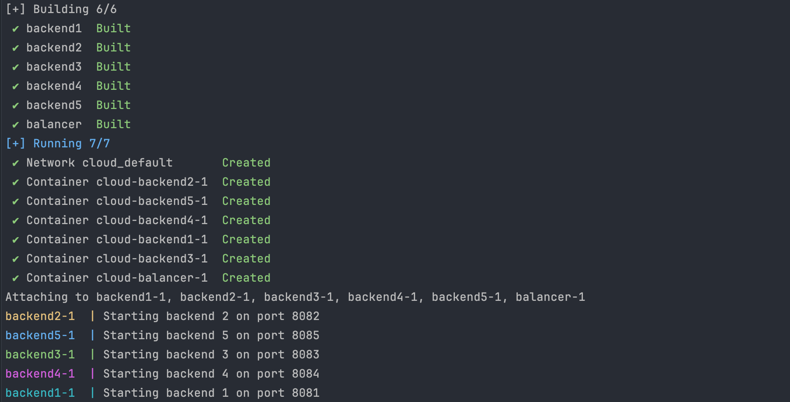
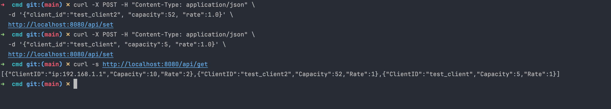

# Cloud Load Balancer

Простой балансировшик нагрузки на Go для распределения http запросов 
между бекенд-серверами с умеренной нагрузкой

## Основные возможности 

- Распределение запросов по алгоритму Round Robin
- Гибкая настройка через конфигурационный файл 
- Логирование (API логирование и логирование ошибок) операций
- Health-check бекенд серверов
- Выдача bucket-token-ов

## Установка

1) > git clone git@github.com:F11uff/Cloud.git 
 
2) > cd Cloud/Balancer/cmd
   
## Работа с Балансировщиком

При запуске программы на порту 8080, в папке логирования (**Balancer/internal/log**) придет информация о 
состоянии сервера и о свободных бекенд-серверах, готовых к работе.

> go run main.go

Папка логирования:

Если мы отправим curl запрос на ** "http://localhost:8080" **, то выведится информация о работе балансировщика, а именно 
на какой сервер ушел запрос, принятый на бекенд-сервере, метод, url бекенд-сервера, время, дата, статус ответа сервера и протяженность по времени
запроса

## Работа с Docker

Для работы с докером написаны два **Dockerfile** и **docker-compose**

### Необходимо запускать контейнер в корневой папке проекта (Cloud)

Команды сборки контейнеров

> docker-compose build --no-cache

> docker-compose up

После работы с докером, выключить контейнеры

> docker-compose down

## Логирование

Логирование происходит с момента запуска сервера в папку **Balancer/log**

## Тестирование

В папке test есть мок-тесты, интеграционные тесты

Запуск:

Для интеграционных тестов

> go test -tags=integration -v integration_test.go

> go test AB_test.go

Для мок-тестирования

> go test balancer_test.go

## Работа с API
**База данных должна быть включенной!**

Чтобы установить токены(JSON можно менять):

>  curl -X POST -H "Content-Type: application/json" \\n  -d '{"client_id":"test_client", "capacity":5, "rate":1.0}' \\n  http://localhost:8080/api/set

Чтобы проверить, как работает API

>  curl -s http://localhost:8080/api/get

Выдастся список:

